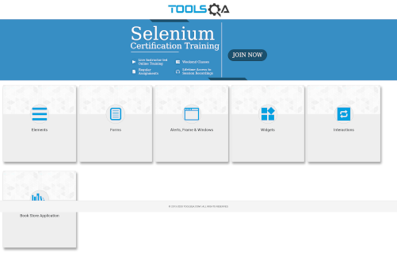

# Homework 05-02

## Instructions

Define in the testng.xml ([demoqa.xml](src/test/resources/demoqa.xml),
[demoqa_forms.xml](src/test/resources/demoqa_forms.xml) and
[demoqa_automationpracticef.xml](src/test/resources/demoqa_automationpracticef.xml))
the browsers you wish to support.
Then modify [DriverFactory.java](src/test/java/utils/DriverFactory.java) to instantiate such browsers.

## Exercise

1. Go to https://demoqa.com/
2. Find the element "Forms", click it and assert it redirects to "demoqa.com/forms"
3. Find the element "Practice Form", click it an assert it redirects to "demoqa.com/automation-practice-form"
4. Fill the inputs for Name, Email, Mobile, Subjects and Current Address using the correct method and assert that each input contains the correct text.
5. Select any gender option
6. Complete the Date of Birth using clicks and then assert the input has the correct date.
7. Select any Hobby option
8. Add an Image to the "Select Picture" input
9. Complete the dropdown of State and City and validate the text displayed is correct.
10. Click on “Submit” button
11. Once submitted validate that the pop-up is shown and the information is correct, then close the pop-up
